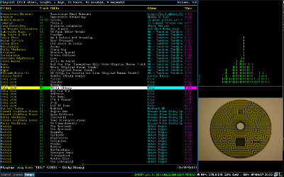

Use a json layout for i3 windowmanager to open a splits screen with ncmpcpp (Mpd client), nausea (terminal based visualiser) and xmv displaying cover art (see mpccoverart script). 

This script is called with this line in i3 config file:

    bindsym $mod+5 workspace $tag5 exec "pgrep ncmpcpp || ~/.config/i3/loadlayout_ncmpcpp.sh" 

